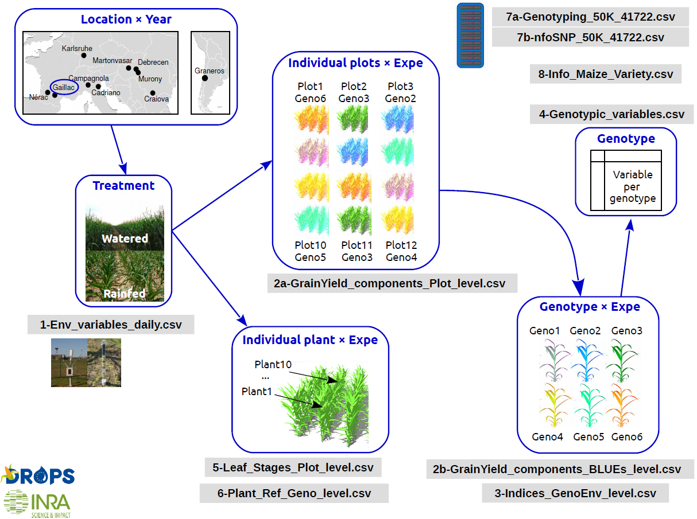

layout: true
background-image: url(Images/logos_new.png)
background-position: 50% 100%
background-size: 30%

---

## Topics for today

- Explain the dataset we will be working with 

- Data format 

- Visual data

- Treatment effects 

- What to extract from your analysis 

---

### Dataset: A multi-site experiment in a network of European fields for assessing the maize yield response to environmental scenarios

```{r cycle, echo = FALSE, out.width = '60%',fig.align = "center"}

```


###### Citation: Millet, Emilie J.; Pommier, Cyril; Buy, Mélanie; Nagel, Axel; Kruijer, Willem; Welz-Bolduan, Therese; Lopez, Jeremy; Richard, Cécile; Racz, Ferenc; Tanzi, Franco; Spitkot, Tamas; Canè, Maria-Angela; Negro, Sandra S.; Coupel-Ledru, Aude; Nicolas, Stéphane D.; Palaffre, Carine; Bauland, Cyril; Praud, Sébastien; Ranc, Nicolas; Presterl, Thomas; Bedo, Zoltan; Tuberosa, Roberto; Usadel, Björn; Charcosset, Alain; van Eeuwijk, Fred A.; Draye, Xavier; Tardieu, François; Welcker, Claude, 2019, "A multi-site experiment in a network of European fields for assessing the maize yield response to environmental scenarios", https://doi.org/10.15454/IASSTN, Portail Data INRAE, V2, UNF:6:zF9w0A2f+MHeW7maeeXJWA== [fileUNF] 


---

## Experiment detail

A panel of 256 maize hybrids was grown:
- with two water regimes (irrigated or rainfed),
- in seven sites spread along a climatic transect from western to eastern Europe
- in 2012 and 2013

which equals 29 experiments,  as the combination of one year, one site and one water regime, with two and three repetitions for waterred and rainfed treatments, respectively. 

Measurements: 
- Hourly records of micrometeorological data and soil water status, and associated with precise measurement of phenology
- **Grain yield and its components at the end of the experiment** 


---

## Statistical Analysis

What is the **first** step to do when you start your statistical analysis? 

--

### <center> State the specific research question(s) </center>

Your statistical test should be based on the biological question.

--

Examples:

1. Is there a relation between the grain weight and the tassel height in the Gaillac site?

2. What is the effect of the plant height on the grain yield?

3. What is the effect of the plant height and tassel height on the grain number?

4. What is the effect of the water treatment on plant height? 

5. What is the effect of the water treatment and the varity ID on grain weight

6. What are the effect of the grazing treatment and roots length on fruit production? 

---

## Today's objectives 

- Go through 6 questions together, then individually

- Look into detail our analyses 

- Meanwhile, go through important concepts to keep in mind

---

## Data Import

```{r perso lib, echo=FALSE, include=FALSE}
library(huxtable)
library(latex2exp)
```


```{r , message = FALSE, warning = F}
library(PerformanceAnalytics)
library(tidyverse)
library(corrplot)
library(multcomp)
library(nlme)
library(lme4)

# not needed in a R project :
# dir <- getwd()
# setwd(dir)


maize_data <- read.table("Data/Maize_data/2a-GrainYield_components_Plot_level.csv",
                         header = T, sep = ",") %>% 
  dplyr::select(-type)
```

**Note:** Because we are importing a `.csv` file, the `sep = ` will be a comma. 
--

```{r, echo=FALSE, fig.cap="", out.width = '30%',fig.align = "left"}
knitr::include_graphics("Images/week1/exercise_smaller.png")
```

What kind of data do we have here? 

**Hint:** Click on the data in your Global Environment, and use the `str()` function, 

---

## Converting our data into the proper format 

You could write out each individual column in the following way:

`maize_data$year <- as.factor(maize_data$year)`

`maize_data$Replicate <- as.factor(maize_data$Replicate)`

etc...

--

OR you could use `mutate_if()` from the `dplyr` package. 

Here, the function states "If a column is a character, convert it as a factor" for the entire data frame. 

```{r}
maize_data <- maize_data %>%
  mutate_if(is.character, as.factor)

```

- It is important to this at the beginning to reduce future problems with analyses.

- **Tip:** try to name your columns in a consistent manner (i.e. all variables with capital first letter), because R is case-sensitive


---

## Exploring the data

```{r, echo=FALSE, fig.cap="", out.width = '30%',fig.align = "left"}
knitr::include_graphics("Images/week1/exercise_smaller.png")
```

How many observations do we have per experiment? 

**Hint:** use the `table()` function

--

```{r}
table(maize_data$Experiment)
```

What do we see here? Does this make sense? Think of the experiment set up. 

---

## Reminder: some statistical tests
```{r preparation Hux table, echo=FALSE, message=FALSE}
Tab <- huxtable(
  "N sample" = c(rep(1, 2), rep(2, 4), ">2"),
  "Var type" = c("Qualitative", "Quantitative", "Qualitative", "Quantitative", "Quantitative", "Quantitative", "Quantitative "),
  "Statistical question" = c("Adjustment to a theoretical law", "Normality", "Ditributions independence", "Homoscedasticity",
                             "Mean comparison", "Relation", "Mean comparison"),
  "Parametric" = c("Test adjustment \n (n>5)", "Shapiro test", "χ2 independence \n (n>5)", "Bartlett test", "Student test",
                   "- Pearson correlation \n - linear regression", "- ANOVA \n - Tukey test"),
  "Non-parametric" = c("Fisher test \n (n≤5)", "Shapiro test", "Fisher test \n (n≤5)", "Bartlett test", 
                       "- Mann-Whitney test \n (paired samples) \n - Wilcoxon test \n (non-paired samples)", 
                       "Spearman correlation", "Kruskal-Wallis test")
)
```

```{r Hux table, echo=FALSE}
Tab2 <- Tab %>% 
  merge_repeated_rows(., everywhere) %>% 
  merge_cells(., 3, c(4,5)) %>% 
  merge_cells(., 5, c(4,5)) %>% 
  set_align(., 3, c(4,5), "center") %>% 
  set_align(., 5, c(4,5), "center") %>% 
  set_font_size(., 1, 1:5, 14) %>%
  set_bold(., 1, 1:5) %>%
  set_font_size(., 2:8, 1:5, 10) %>%
  set_valign(., 1:8, 1:5, "middle") %>% 
  set_background_color(., 1:8, 1:5, "white") %>% 
  set_bottom_border(., value = brdr(0.4))
Tab2
```

---
## Reminder: α risk, β risk and power

.pull-left[
**H<sub>0</sub>:** null hypothesis, there is no effect.
<br>

- **Risk α** (type 1 error): <br> P(reject H<sub>0</sub> | H<sub>0</sub> TRUE)

- **Risk β** (type 2 error): <br> P(conserve H<sub>0</sub> | H<sub>0</sub> FALSE)

- **Power:** <br> P(reject H<sub>0</sub> | H<sub>0</sub> FALSE) <br> β = 1 - Power
]

.pull-right[
```{r, echo=FALSE, out.width='80%', fig.align='center'}
knitr::include_graphics("Images/week2/alpha_pow.png")
```

```{r, echo=FALSE, out.width='80%', fig.align='center'}
knitr::include_graphics("Images/week2/alpha_Npow.png")
```
]

---
layout: false

class: center, middle

## Question 1: Is there a relation between the grain weight and the tassel height in the Gaillac site? 

---

layout: true
background-image: url(Images/logos_new.png)
background-position: 50% 100%
background-size: 30%

---

## Question 1: Is there a relation between the grain weight and the tassel height in the Gaillac site? 

Key parts to this question: 

- Relation between two **numerical** variables

- What are the units? 

`grain.weight`: individual grain weight (mg)

`tassel.height`: plant height including tassel, from ground level to the highest point of the tassel (cm)

Thus, they are both **continuous** variables

---

## Reminder

```{r continuous, echo = FALSE, out.width = '80%', fig.align = "center"}
knitr::include_graphics("Images/week2/continuous_discrete.png")
```
<center> @allison_horst </center>


---

## Data Frame 


```{r, echo=FALSE, fig.cap="", out.width = '30%',fig.align = "left"}
knitr::include_graphics("Images/week1/exercise_smaller.png")
```
First, separate the data frame to only include values from the Gaillac site. 

**Hint:** use piping `%>%` and the `filter()` function.

--

```{r}
maize_Gaillac <- maize_data %>%
  filter(Site == "Gaillac")
```

---

## Visualize the relation between grain weight and tassel height 
```{r, out.width = '60%', fig.align = "center"}
plot(maize_Gaillac$grain.weight ~ maize_Gaillac$tassel.height)
```

---

## Do the statistical test 

Which test do you think we should use? Why? 

--

### <center> Pearson's correlation </center>

**Why?** 
- Looking for the **relation** between two variables 
- There is not a clear cause and effect relationship between the variables <br> (linear regression)
- There may be a third non-measured variable which acts on both the variables in the correlation 

---

## Correlation vs linear regression

**Correlation** 

- used to associate two variables (no cause and effect)
- mostly used as a "pre-analysis" phase to determine relations between explanatory variables (note: in different )

**Linear regression**

- often used for observational studies
- a cause and effect relationship is difficult to assure without having controled for other pertinente variables 
- be careful with interpretation

---

## What are the test assumptions for Pearson's correlation? 

**1.**  each variable should be continuous

**2.** related pairs: each value should have both a grain yield and a tassel height value

**3.** absence of outliers: can skew 

**4.** linearity: the shape of the dots is a line and not curved

**Tip:** you can find test assumptions online 

---

## Do we satisfy the test assumptions? 

[**x**] **1.** Both variables are continuous

Related pairs? Let's remove the na values from the data frame using the `drop_na()`.

```{r}
maize_Gaillac <- maize_Gaillac %>%
  drop_na("grain.weight", "tassel.height")
```
[**x**] **2.** NA values removed

---

Are there outliers which could skew the correlation? 

```{r, out.width = '50%', fig.align = "center"}
plot(maize_Gaillac$grain.weight ~ maize_Gaillac$tassel.height)
```

Visually, we can determine to remove the values at the bottom of the graph, with grain weights lower than 100mg.

---

```{r, echo=FALSE, fig.cap="", out.width = '30%',fig.align = "left"}
knitr::include_graphics("Images/week1/exercise_smaller.png")
```
Remove the values with a grain weigh lower than 100 mg to create a new data frame for the analyses. 

**Hint:** use the `filter()` function.

--

```{r}
maize_Gaillac_red <- maize_Gaillac %>%
  filter(grain.weight>100)
```

---
Check the number of observations in each data frame in your Global Environment. You can also check with a graph:

```{r, out.width = '40%', fig.align = "center"}
plot(maize_Gaillac_red$grain.weight ~ maize_Gaillac_red$tassel.height)
```

[**x**] **3.** Outliers removed

[**x**] **4.** Linearity (no curved shape within the dots)

---

## Pearson's correlation

Here the p-value corresponds to the statistical test with 

**H<sub>0</sub>** : r = 0 (there is no correlation) 

**H<sub>1</sub>** : r <span>&#8800;</span> 0

--

```{r}
cor.test(maize_Gaillac_red$grain.weight, maize_Gaillac_red$tassel.height)
```

The Pearson's correltation shows a significant positive (`cor` value is positive) relationship. 

---
**However,** a significant result is not very informative (with a large number of samples, anything can become significant)

It is better to look at the strength of the correlation (r<sup>2</sup>)

--

## Finding the r<sup>2</sup>

The r<sup>2</sup> is the r correlation value, squared (i.e. coefficient of determination)

```{r}
cor(maize_Gaillac_red$grain.weight, maize_Gaillac_red$tassel.height)^2
```

We can conclude that **1.87%** of the variation of the grain weight is associated to the tassel height.
---

## Subsetting for a correlation matrix

We can get a quick overview of how all of our numeric columns value  relate to one another 

First, we need to subset only the numeric columns. One way we can do this is by viewing our data table and noting the numeric columns.
```{r}
maize_Gaillac_num <- maize_Gaillac_red[,c(13:21)]
```

Or, we could select columns which are numeric using `select(where(is.numeric))` 

```{r}
maize_Gaillac_num <- maize_Gaillac_red %>% 
  dplyr::select(where((is.numeric))) %>% 
  dplyr::select(-c(year, Replicate, block, Row, Column, Code_ID))
# The last line remove irrelevant columns
```
**Note:** the `select()` function is present in several packages, so by using `dplyr::` we are telling R in which package to take the function.   

--

We need to remove NA values from the data frame: use the `na.omit()` function. 
```{r}
maize_Gaillac_num <- na.omit(maize_Gaillac_num)
```

---

We will use a function which needs a correlation matrix from our values. To do so, we will use the `cor` function.
```{r, echo=FALSE}
corr_maize <- cor(maize_Gaillac_num) ; head(corr_maize, 6) # head return the first 6 lines
```


---

## Correlation matrix

Positive correlations are displayed in blue and negative correlations in red color. Color intensity and the size of the circle are proportional to the correlation coefficients. 

```{r, fig.align='center', fig.width=9, fig.height=5}
corrplot(corr_maize, method = "color", type = "upper", addCoef.col = "black",  
         tl.srt = 35, tl.col= "black",   cl.cex = 1)
```

---

## Another function

`chart.Correlation()` from the package `PerformanceAnalytics`:

```{r, echo=FALSE, fig.width=9, fig.height=6}
chart.Correlation(maize_Gaillac_num, histogram = TRUE, method = "pearson")
```

---

## Your turn
```{r, echo=FALSE, fig.cap="", out.width = '30%',fig.align = "left"}
knitr::include_graphics("Images/week1/exercise_smaller.png")
```

Using the previous data table, what is the relation between grain weight and tassel height within the waterred site? And within the rainfed site? 

---
## Solution

```{r}
maize_Gaillac_wat <- maize_Gaillac_red %>%
  filter(treatment == "watered")

cor(maize_Gaillac_wat$grain.weight, maize_Gaillac_wat$tassel.height)^2
```

We can conclude that **7.49%** of the variation of the grain weight is associated to the tassel height if we only include the watered sites.
--

```{r}
maize_Gaillac_rain <- maize_Gaillac_red %>%
  filter(treatment == "rainfed")

cor(maize_Gaillac_rain$grain.weight, maize_Gaillac_rain$tassel.height)^2
```

We can conclude that **4.36%** of the variation of the grain weight is associated to the tassel height if we only include the rainfed sites.

Does this make sense? 

---

## For te next analysis: reduce the `maize_data` dataframe 

```{r, echo=FALSE, fig.cap="", out.width = '30%',fig.align = "left"}
knitr::include_graphics("Images/week1/exercise_smaller.png")
```
Separate the data frame. 

- Only the year 2012

- To simplify our question, we will focus on three Varieties: 
`"HMV5422"`,`"11430"` and `"F712"`

  **Hint:** use the `|` symbol to include several values for `Variety_ID`

- Remove the NA values from all the columns

---

## Answer

```{r}
maize_2012 <- maize_data %>%
  filter(year == "2012") %>%
  filter(Variety_ID == "HMV5422" | Variety_ID == "11430" | Variety_ID == "F712")%>%
  drop_na(.) %>%
  droplevels() #we need to add this to remove the other levels of Variety 
```

---
layout: false

class: center, middle

## Question 2: What is the effect of the plant height on the grain yield? 

---

layout: true
background-image: url(Images/logos_new.png)
background-position: 50% 100%
background-size: 30%

---

## Question 2: What is the effect of the plant height on the grain yield? 

Key parts to this question: 

- Effect of **one numerical** variable on another **numerical** variable

- What are the units? 

`plant.height`: plant height from ground to the base of the flag leaf (cm)

`grain.yield`: grain yield adjusted at 15% humidity (t ha<sup>-1</sup>)

They are both **continuous** variables

--

<br><br><br>**Question:** What is the statistical approach we should use ?

---

## What are the Linear Model assumptions?

Before analyzing the data, check the following assumptions: 

1. Homogeneity (or homoscedasticity) of variances (look at residuals vs fitted)

2. Normality of **residues** <br> (but normality isn't as important as homoscedasticity)

3. No outliers

4. Data are randomly selected and are independent

--

<br>**Note:** Balanced data should be preferred

---
## Linear model: general equation

.pull-left[
**Math equation:** 

$Ŷ = Xβ$ <br> OR <br> $y_i = a \times x_i + b + \epsilon_i$

With:

- `Y` and $y_i$ the explained variable
- `X` and $x_i$ the explanatory variable(s)
- `β` the model parameters :
  - `a` the slope
  - `b` the intercept
- $\epsilon_i$ the model residuals (error)
]

.pull-right[
```{r echo=FALSE, fig.cap="", out.width = '110%',fig.align = "right"}
knitr::include_graphics("Images/week2/LM.png")
```
]

--

**Note:** 

The regression line is determined by reducing the model residuals

`a` and `b` are determined in order to reduce the residual sum of square: $SSres = \sum \epsilon_i^2$

---

## Data representation

```{r, fig.align='center', fig.height=5.5, fig.width=9}
plot(grain.yield ~ plant.height, data = maize_2012)
```


---
## Using the `lm()` function: simple regression

```{r LM simpl}
mod1 <- lm(grain.yield ~ plant.height, maize_2012)

summary(mod1)

```

---

## Check model assumptions
```{r ,out.width = '50%', fig.align = "center" }
par(mfrow = c(2, 2)) ; plot(mod1)
```

Normality test: `shapiro.test` (limit of the normality of residues in linear models [here](https://stats.stackexchange.com/questions/2492/is-normality-testing-essentially-useless))

---

## Model representation

```{r, fig.align='center', fig.height=5.5, fig.width=9}
plot(grain.yield ~ plant.height, data = maize_2012)
abline(mod1, col = "red")
```


---

## Model parameters and predictions

.pull-left[
Model coefficients:
```{r coef}
coef(mod1)
```
]

--

.pull-right[
Model confidence interval:
```{r IC}
confint(mod1)
```
]

--

Model Predictions: `predict(mod1)` with `interval = ""` as argument.

```{r m1pred1, echo=FALSE, message=FALSE}
maize_2012_2 <- maize_2012

mod1_pred1 <- as.data.frame(predict(mod1, interval = "confidence", newdata = maize_2012_2))
maize_2012_2$mod1_fit.f <- mod1_pred1$fit
maize_2012_2$mod1_upr.c <- mod1_pred1$upr
maize_2012_2$mod1_lwr.c <- mod1_pred1$lwr

mod1_pred2 <- as.data.frame(predict(mod1, interval = "prediction", newdata = maize_2012_2))
maize_2012_2$mod1_upr.p <- mod1_pred2$upr
maize_2012_2$mod1_lwr.p <- mod1_pred2$lwr
```

```{r Figm1pred1, echo=FALSE, fig.height=3.5, fig.width=8, fig.align='center'}
ggplot(maize_2012_2) +
  geom_point(aes(x = plant.height, y = grain.yield), size = 2) +
  geom_line(aes(x = plant.height, y = mod1_fit.f), 
            linewidth = 1, col = "darkblue") +
  geom_line(aes(x = plant.height, y = mod1_upr.c), 
            linewidth = 1, linetype = "dashed", col = "darkred") +
  geom_line(aes(x = plant.height, y = mod1_lwr.c),
            linewidth = 1, linetype = "dashed", col = "darkred") +
  geom_line(aes(x = plant.height, y = mod1_upr.p),
            linewidth = 1, linetype = "dotted", col = "darkgreen") +
  geom_line(aes(x = plant.height, y = mod1_lwr.p), 
            linewidth = 1, linetype = "dotted", col = "darkgreen") +
  labs(x = "Plant height", y = "Grain yield") +
  theme_bw() +
  theme(axis.text = element_text(colour = "black"))

```

---

layout: false

class: center, middle

## Question 3: What is the effect of the plant height and tassel height on the grain number? 

---

layout: true
background-image: url(Images/logos_new.png)
background-position: 50% 100%
background-size: 30%

---

## Question 3: What is the effect of the plant height and silking on the grain yield? 

Key parts to this question: 

- Effect of **TWO numerical** variable on **one numerical** variable

- What are the units? 

`plant.height`: plant height from ground to the base of the flag leaf (cm)

`grain.yield`: grain yield adjusted at 15% humidity (t ha<sup>-1</sup>)

`silking`: cumulated thermal time (d20°C) from emergence to flowering

They are all **continuous** variables

---

## Using the `lm()` function: multiple regression

Multiple regression are written as follow:

```{r}
mod2 <- lm(grain.yield ~ plant.height*silking, maize_2012)
```

**Note**: A $\times$ B is the same as A+B+A:B; **A** and **B**: the main predictors; **A:B** the interaction

--

```{r, echo=FALSE}
summary(mod2)
```

---

## Check model assumptions
```{r ,out.width = '60%', fig.align = "center" }
par(mfrow = c(2, 2)) ; plot(mod2)
```

---

## On problem: (multi) collinearity

When the predictors are **correlated**.

--

<br> **Effect:**

- Increase estimates standard error

- Lose of prediction power

- Due to confounding variable <br> (influence both explicative and explained variables)

--

<br> **Problem resolution:**

- We don't care if it's for prediction

- Obtain more data

- Eliminate one variable

- Scale the explicatives variables: `mean = 0` and `sd = 1`

---

layout: false

class: center, middle

## Question 4: What is the effect of the water treatment on plant height? 

---

layout: true
background-image: url(Images/logos_new.png)
background-position: 50% 100%
background-size: 30%

---

## Question 4: What is the effect of the maize variety on plant height? 

Key parts to this question: 

- Effect of **ONE factor** (water regime) on a **numerical** variable (plant height)

- `plant.height` : from ground level to the base of the flag leaf (highest) leaf (cm), continuous variable 


---

## Linear model: one factor

Model representation:

```{r, fig.align='center', fig.height=5, fig.width=9}
boxplot(plant.height ~ Variety_ID, maize_2012, col = c("brown1", "chartreuse3", "cyan3"))
abline(a = mean(maize_2012$plant.height), b = 0, lwd = 2, col = "purple")
```

---

## Using the `lm()` function: one factor

```{r}
mod3 <- lm(plant.height ~ Variety_ID, maize_2012)
summary(mod3)
```

---

## Check model assumptions
```{r ,out.width = '60%', fig.align = "center" }
par(mfrow = c(2, 2)) ; plot(mod3)
```

---

## Analysis of variance (ANOVA)

- Variance can be used to test whether means of a factor differed: <br> as the means become more different, the variances increase 

```{r, echo=FALSE, fig.cap="", out.width = '80%',fig.align = "center"}
knitr::include_graphics("Images/week2/variance.png")
```

---

## ANOVA Several options:

<br>
- `aov` function: (sensitive to unbalanced dataset)

  `mod_aov <- aov(x ~ a)` <br>
  `mod_aov` output is directly the Analysis of Variance Table
    
<br>
- `anova` function:

  `mod_lm <- lm(x ~ a)`<br>
  `anova(mod_lm)` gives the Analysis of Variance Table 

---

## Check for balanced data: 

<br>**Hint:** use the `table()` function for our factors to see if we have a balanced dataset for the factor in our dataset.  

```{r}
table(maize_2012$Variety_ID)
```
**Note:** linear model work with unbalanced date, but effects are more tricky to analysed.

---

## One-way ANOVA

With one factor, the ANOVA detect if the factor within group variance is in the same magnitude as the residual variance (residuals are model error).

We will use the `anova` function: `anova(mod3)` 


```{r, echo = FALSE}
anova.m3 <- anova(mod3)

huxtable(anova.m3,  add_rownames = TRUE) %>% 
  set_bottom_border(1, 1:6, 0.4) %>% 
  set_bottom_border(3, 1:6, 0.4) %>% 
  set_bold(1, 1:6) %>% 
    set_background_color(., 1:3, 1:6, "white")
```
--

We will decipher the Analysis of Variance table in detail with the next example.

**Note 1:** an anova is basically an extended t-test <br> (which compares the variance of two groups)

**Note 2:** an one-way ANOVA is used when the factor present three or more levels

---

## Order of factor levels

Is the order of factor levels important?

- **YES**: example of fertilization treatment with `low`, `medium`, `high`
- **NO**: example of the flower fragrance with `frangrance 1`, `frangrance 2`

--

In `lm()` function: the `contrast` argument:

| Contrast argument | calculation |
|-------------------|-------------|
|`contr.treatment()` (default)|compares each factor level to the reference level|
|`contr.sum()`|compares each factor level to general mean|
|`contr.poly()`|for one variable, detect polynomial effect|
|`contre.helmert()`|compares each factor level to the average of the next levels|

--

Change factor level reference with `relevel` OR `fct_relevel`.

---

layout: false

class: center, middle

## Question 5: What is the effect of the water treatment and the maize variety on grain weight? 

---

layout: true
background-image: url(Images/logos_new.png)
background-position: 50% 100%
background-size: 30%

---

## Question 5: What is the effect of the water treatment and the varity ID on grain weight? 

Key parts to this question: 

- Effect of **TWO factors** (water regime and maize variety) on a **numerical** variable (grain weight)

- `grain.weight` : mass of individual grain (g), continuous variable 

---

#ANOVA reminder:  `x ~ a+b+a:b` 

| Factor |Type 1 ANOVA | Type 2 ANOVA | Type 3 ANOVA |
|--------|-------------|--------------|--------------|
| **Factor A** | SS(A) | SS(A I B) | SS(A I B, AB) |
| **Factor B** | SS(B I A) | SS(B I A) | SS(B I A, AB) |
| **Interaction AB**| SS(AB I B, A) | NA | SS(AB I B, A)|
| **Notes**|  SS(A) + SS(B I A) = <br> SS(A, B) |SS(A I B) + SS(B I A) ≠ <br> SS(A, B) |NA|

--

.pull-left[
**Type 1:** 
- H<sub>0</sub> for A: Means for each levels weighted by sample size are equal 
- SS depend on factor order
- Sensitive to model balance

**Type 2:** 
- We assume no interaction between A and B
]

--

.pull-right[

**Type 3:** 
- For A and B: Means for each levels **NOT** weighted by sample size are equal
- Use the contrast `contr.sum`
]

---

## Linear model: two factors

```{r, fig.width=18,fig.height=8}
boxplot(grain.weight ~ treatment*Variety_ID, data = maize_2012)
```

What can we see?

--

- There seems to be a positive effect of watering plants on grain weight depending on maize variety (makes sense). We don't see a clear treatment effect, but there might be. 

---

## Testing models

Can we use `aov()`? **Hint:** The `aov` function is a type 1 ANOVA.


--
```{r}
replications(grain.weight ~ treatment+Variety_ID, data = maize_2012)
```

Because we have unbalanced data, it is better to use the `lm()` function.

--

<br>**Notes:** for type 2 and 3 ANOVA, use the `Anova` function from the `car` package.

---

## Using the `lm()` function: two factor


```{r}
mod4 <- lm(grain.weight ~ treatment + Variety_ID, data = maize_2012)
summary(mod4)
```

---

## Check the assumptions

```{r ,out.width = '60%', fig.align = "center" }
par(mfrow = c(2, 2)) ; plot(mod4)
```

---
## Looking at the analysis of variance table

```{r, echo=FALSE}
anova.m4 <- anova(mod4)

huxtable(anova.m4,  add_rownames = TRUE) %>% 
  set_bottom_border(1, 1:6, 0.4) %>% 
  set_bottom_border(4, 1:6, 0.4) %>% 
  set_bold(1, 1:6) %>% 
  set_background_color(., 1:4, 1:6, "white")
```
--

Theoretical calculation:


| Source | SS | df | MS | F |  
|---|---|---|---|---|
|Effect A| given | a-1 | SS/df | MS(A) / MS(W)| 
|Effect B| given | b-1 | SS/df | MS(B) / MS(W)| 
|Effect A:B| given | (a-1)(b-1) | SS/df | MS(A:B) / MS(W)| 
|Within (residuals)| given || SS/df | | 

---

## Let's break down the table output

```{r, echo=FALSE}
anova.m4 <- anova(mod4)

huxtable(anova.m4,  add_rownames = TRUE) %>% 
  set_bottom_border(1, 1:6, 0.4) %>% 
  set_bottom_border(4, 1:6, 0.4) %>% 
  set_bold(1, 1:6) %>% 
  set_background_color(., 1:4, 1:6, "white")
```


Df: degrees of freedom =  the number of values in the final calculation of a statistic that are free to vary 

- Each main effect has k-1 Df 

ex: `Variety_ID` has 3 levels (k=3) so df = 3-1 = 2

and `treatment` has two levels (m=2) so df = 2-1 = 1

---

```{r, echo=FALSE}
anova.m4 <- anova(mod4)

huxtable(anova.m4,  add_rownames = TRUE) %>% 
  set_bottom_border(1, 1:6, 0.4) %>% 
  set_bottom_border(4, 1:6, 0.4) %>% 
  set_bold(1, 1:6) %>% 
  set_background_color(., 1:4, 1:6, "white")
```

- The residuals df is the total number of observations (N) - 1 - the df of each effect (k-1) and (m-1). 
- You can find N by calculating the `length` of `grain.weight` in the maize_2012 data table, or by looking in the Global Environment data values

--

```{r}
length(maize_2012$grain.weight)
```

= N - 1 - (k-1) - (m-1) = 72 - 1 - 2 - 1 = 68

Why is this important? You can use this to better understand tables published in papers. You can also easily see if authors have removed data points from their analysis (the N.)

---

## Fisher's test (Fisher-Snedecor)

<center>Sum of Squares difference between variables / Sum of squares residuals (within) </center>


Ex: If the `Variety_ID` means of grain weight are more different (vary more between the different levels) than the grain weight vary within the different Variety levels, the F-test ratio would be greater than an F-value expected by chance.

```{r, echo=FALSE, fig.cap="", out.width = '60%',fig.align = "center"}
knitr::include_graphics("Images/week2/variance.png")
```

---

## The p-value

```{r, echo=FALSE}
anova.m4 <- anova(mod4)

huxtable(anova.m4,  add_rownames = TRUE) %>% 
  set_bottom_border(1, 1:6, 0.4) %>% 
  set_bottom_border(4, 1:6, 0.4) %>% 
  set_bold(1, 1:6) %>% 
  set_background_color(., 1:4, 1:6, "white")
```

R then compares the F ratio calculated to the expected value given the two degrees of freedom (between the groups and within the groups), with alpha set to 0.05%.

If the p-value is less than the chosen significance level, the data provide sufficient evidence to conclude that your model fits the data better than a model with no independent variables.

Be cautious with interpreting p-values (will go over next week)

---
## Post-hoc tests

The F-test doesn’t reveal which Variety_ID means are different, only that the Variety_ID means are different. 

Therefore, we can do a multiple comparison test, also called a posthoc test 

--
```{r}
modposthoc = lm(grain.weight ~ Variety_ID+treatment, 
                data = maize_2012, na.action=na.omit)
tuk <- glht(modposthoc , linfct = mcp(Variety_ID= "Tukey"))
```

---

```{r}
summary(tuk) 
```

--

We can also use the `cld()` function to get the classic letter display. 
```{r}
tuk.cld <- cld(tuk)   # letter-based display
tuk.cld
```

--

**Note:** for A:B interaction Tukey test, look at the `emmeans` package and function.

---

## New dataset for better understanding the ANCOVA

The Ipomopsis data:

```{r}
Ipo <- read_csv2("Data/Exemple/ipomopsis.csv") %>% 
  mutate(Grazing = as_factor(Grazing),
         Grazing = fct_relevel(Grazing, c("Grazed", "Ungrazed")))

```

<br>

**Ipomopsis:** North-america flower genus, mountainous ecosystem (sub-alpine Rocky mountains)

---

layout: false

class: center, middle

## Question 6: What are the effect of the grazing treatment and roots length on fruit production? 

---

layout: true
background-image: url(Images/logos_new.png)
background-position: 50% 100%
background-size: 30%

---

## Question 6: What are the effect of the grazing treatment and roots length on fruit production? 

Key parts to this question: 

- Effect of **ONE factor** (grazing) and **ONE continuous** variable (number of fruits) on a **numerical** variable (root length)

- `Root`: root size (cm), continuous variable

- `Fruit`: average number of fruits (n), continuous variable

- `Grazing`: grazed or ungrazed plant (factor), discrete variable

--

<br> Which test do you think we should use?

--

**Analysis of covariance (ANCOVA):**

An ANCOVA is the combination of a linear regression and an ANOVA.

---

## Look at the data

`table(Ipo$Grazing)`


```{r, fig.align='center', fig.height=5, fig.width=7}
col1 <- ifelse(Ipo$Grazing == "Grazed", "red2", "chartreuse3")
plot(Fruit ~ Root, Ipo, col = col1, pch = 19)
legend(5, 110, c("Grazed", "Ungrazed"), fill = c("chartreuse3", "red2"))
```

---

## Using the `lm()` function: two factor

```{r}
mod5 <- lm(Fruit ~ Root * Grazing, Ipo)
summary(mod5)
```


---

## Check the assumptions


```{r, fig.align='center', out.width = '60%'}
par(mfrow = c(2, 2)) ; plot(mod5) 
```


---

## Performed the ANCOVA

`anova(mod5)`

```{r, echo=FALSE}
anova.m5 <- anova(mod5)

huxtable(anova.m5,  add_rownames = TRUE) %>% 
  set_bottom_border(1, 1:6, 0.4) %>% 
  set_bottom_border(5, 1:6, 0.4) %>% 
  set_bold(1, 1:6) %>% 
  set_background_color(., 1:5, 1:6, "white")
```

--

What are the conclusion?

--

- Less fruits are produced when the plants are grazed

- Grazing do not influence the fruit production, increasing with root size

---

## Model selection

Build a second model without interaction:

```{r noint}
mod5.b <- lm(Fruit ~ Root + Grazing, Ipo)

```

--

You can check the model summary and assumptions.

--

Which model return the best description of the data? `mod5` or `mod5.b`? 

`anova(mod5, mod5.b)`

```{r select, echo=FALSE}

anova.comp <- anova(mod5, mod5.b)

huxtable(anova.comp,  add_rownames = TRUE) %>% 
  set_bottom_border(1, 1:7, 0.4) %>% 
  set_bottom_border(3, 1:7, 0.4) %>% 
  set_bold(1, 1:7) %>% 
  set_background_color(., 1:3, 1:7, "white")

```
--

None is the best. Always select the most sparing solution.

--

The `mod5.b` should be used.

---

## Your turn

In groups of 2: 

- State a research question for this data set (a response variable, and then one or more explicative variable)

- Divide the original data set by site, year, treatment and/or variety 

- Choose the (or several) fixed effect factors and the response variable according to your research question

- Write your model, test the assumptions and state your results

- Calculate the n, mean, and standard error for your groups 

---

## Next week 

- Generalized linear models

- Pseudoreplication

- Heritability

- (Introduction to non-linear models and generalized additive models)


---

## References

Schumaker & Tomek 2013. Understanding Statistics Using R. *Springer*

http://www.sthda.com/english/wiki/visualize-correlation-matrix-using-correlogram 

https://howecoresearch.blogspot.com/2019/01/using-analysis-of-variance-anova-in.html 

Ressources: 

https://www.youtube.com/watch?v=-yQb_ZJnFXw 