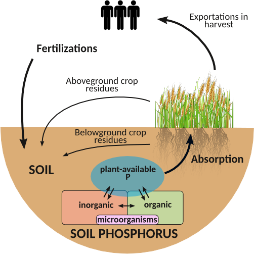
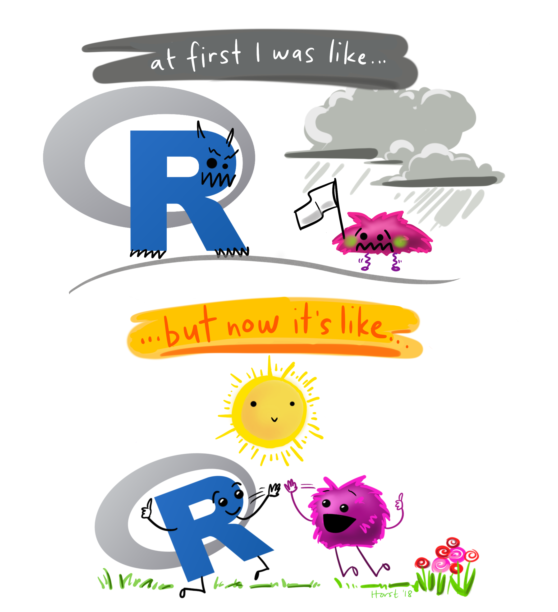
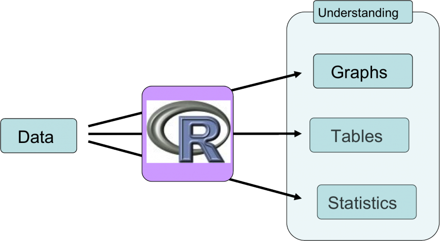
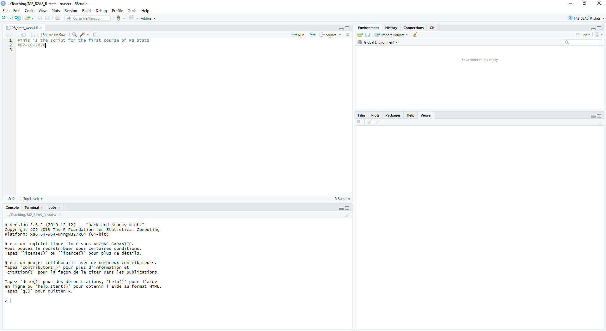
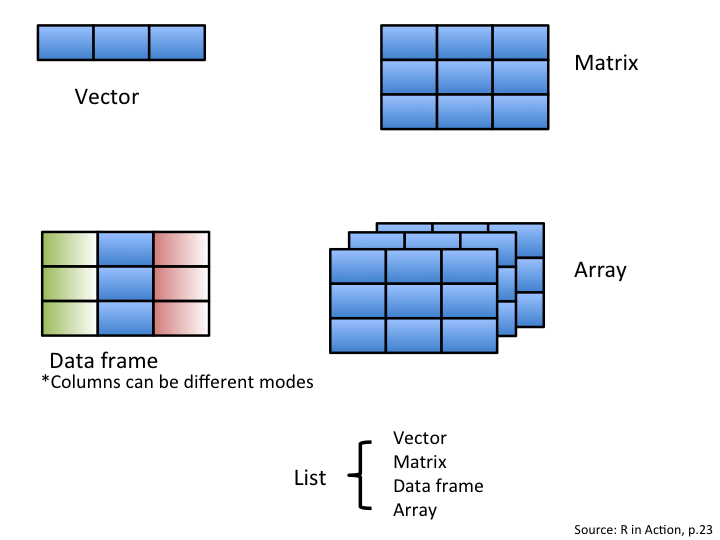
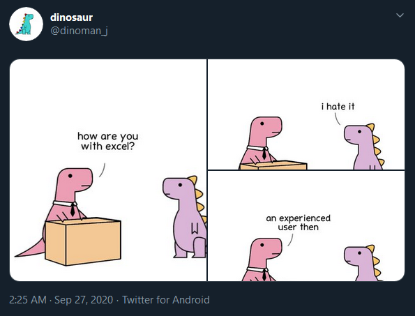

```{r loading PKG, echo=FALSE, include=FALSE}
library(gridExtra)
library(ggplot2)
library(grid)
library(png)
library(tidyverse)
```

```{r, include = F}
# this is the session info, it gives information on which packages and which versions were used when creating these slides
# do not run these lines, as they are the output of the function sessionInfo()

# sessionInfo()
# R version 4.1.3 (2022-03-10)
# Platform: x86_64-redhat-linux-gnu (64-bit)
# Running under: Fedora Linux 36 (Workstation Edition)
# 
# Matrix products: default
# 
# locale:
#  [1] LC_CTYPE=fr_FR.UTF-8    
#  [2] LC_NUMERIC=C
#  [3] LC_TIME=fr_FR.UTF-8       
#  [4] LC_COLLATE=fr_FR.UTF-8    
#  [5] LC_MONETARY=fr_FR.UTF-8   
#  [6] LC_MESSAGES=fr_FR.UTF-8   
#  [7] LC_PAPER=fr_FR.UTF-8      
#  [8] LC_NAME=C                 
#  [9] LC_ADDRESS=C              
# [10] LC_TELEPHONE=C            
# [11] LC_MEASUREMENT=fr_FR.UTF-8
# [12] LC_IDENTIFICATION=C   
# attached base packages:
# [1] stats     graphics  grDevices utils     datasets  methods   base     
# 
# other attached packages:
# [1] dplyr_1.0.6
# 
# loaded via a namespace (and not attached):
#  [1] compiler_4.1.3  fastmap_1.1.0   cli_3.3.0      
#  [4] htmltools_0.5.2 tools_4.1.3     rstudioapi_0.13
#  [7] xaringan_0.26   yaml_2.3.5      rmarkdown_2.14 
# [10] knitr_1.39      xfun_0.31       digest_0.6.29  
# [13] rlang_1.0.3     evaluate_0.15  

```


layout: true
background-image: url(Images/logos_new.png)
background-position: 50% 100%
background-size: 30%

---

## Who am I?
- Final year PhD student at INRAE, finishing a double degree program between the Université de Bordeaux and Université Laval in Québec

- Studying the dynamic and modelling of organic phosphorus in cropped soil under various field conditions.

- R enthusiast, coder


```{r cycle, echo = FALSE, out.width = '40%',fig.align = "center"}

```


---

## 

```{r intro pic, echo=FALSE, fig.cap="", out.width = '60%',fig.align = "center"}

```
<center> @allison_horst </center>

---
## R Course Objectives

- Understand the basis of the R language to be able to write your own scripts

--

- Optimize your dataset table (7/11)

--

- Choose a statistical model according to your scientific question (10/11 & 14/11)

--

- Create reproducible graphics (17/11)

--

- Know how to search for resources related to your question or code problem in R

---

## How this course works

- This is an interactive course, which means you will be coding throughout the course

- When you see this symbol, you use code to answer a question that I've stated:

```{r, echo=FALSE, fig.cap="", out.width = '25%',fig.align = "left"}

```

- Don't hesitate to ask questions  

- There will be a final project to be done in groups of 2, with a presentation on November 24th (more details will be given at the end of this course). 

---

layout: false

class: center, middle

## R basics

---

layout: true
background-image: url(Images/logos_new.png)
background-position: 50% 100%
background-size: 30%

---

## The multiple facets of R 

R is a programming language, and RStudio is a graphical interface to help users with R  

R is open source, which means there are plenty of great solutions to issues that can be found online 

--

```{r why r pic, echo=FALSE, fig.cap="", out.width = '80%',fig.align = "center"}

```
<center> @CSBQ </center>


---
## Let's get started

**Step 1:** Create a new folder for the R course

**Step 2:** Open Rstudio, click on:  

<center> File → New File → R Script </center>

**Step 3:** Save the R Script with an easy-to-find name in the new-created folder

<br> 

--

## Good Practices

- Comment your code by using the # symbol 
- Write in your script, and then click **run** to evaluate the code in the console 

**Tip:** You can also press "Ctrl" and "Enter" to run your code

---

## Explore R Studio

```{r rstudio, echo=FALSE, fig.cap="", out.width = '100%',fig.align = "center"}

```

**Tip:** you can change the colors of RStudio in 

<center> Tools → Global Options → Appearance </center>

---

## Working directory

### In RStudio
We use the `setwd()` function so that R knows where to look for the data table. We can use `getwd()` to see in which directory we currently are.

```{r setwd}
# getwd()
```

--

**Tip:** manually set your directory by clicking

<center> Session → Set Working Directory → Choose Directory </center>

Copy-paste the output from the R console into your script so that you only need to do it once. 

```{r}
# setwd("/directory/of/your/R-script/from/root")
```

---
## Saved by the R project

<center> Go up-left or up-right → Create new project → Choose Directory </center>

**Advantages:**
- All your scripts, data, table and figure in one folder
- Relative path for working directory
- Code reproducibility
- Allow to use Git for code versioning (advanced use)

--

**Give it a try:**

```{r}
getwd()
```

---

## Renv the package manager

Within a open R project:

<center> Tools → Project Options → Environments → Tick *use renv* </center>

**Advantages:**

- Local save of packages and their versions
- Limit code break due to package update

--

**Tips:**

Some renv functions (call: `renv::function()`):

| Function | effects  | Function | effects | 
|---| ---  | --- | ---  |
| activate() | activate renv | upgrade() | upgrade renv version |
| install() | install a package | update()  | update packages |
| snapshot() | save packages versions | restore()   | restore packages version | 

---

## Structure your R project

**Arrange your R scripts and folders:**
- Name your scripts starting by a number (example: 01_name.R)

Tells you which script to run first !

- Examples of folders "Data", "Export", "Export/Figure"

--

**Structure your code:**
- Header
- Working directory check
- Loading packages (next slide)
- Data import (further slide)
- Divide your code in parts

--

**Tips (dispensable):** 

- create a separate .R script for functions (`source("name_of_fun_file.R")`)
- Use the snippets for automatic code: copy/paste the Snippet.txt in

<center> Tools → Edit Code Snippets </center>

---
## Loading the necessary package(s)

If you have not yet installed the metapackage `tidyverse`, you can do by clicking in the bottom right pannel: 

<center> Packages → Install, and typing the package name </center>

You can also run it in your script without the `#`:
```{r}
# install.packages("tidyverse")
```
Or
```{r}
# renv::install("tidyverse")
```
--

You need to tell R where to look in its library for the packages you will use in your script.

```{r}
# library(tidyverse)
```

**Tip:** At the beginning of each script, only include the libraries which you will actually use. 

---

## R as a calculator

```{r, echo=FALSE, fig.cap="", out.width = '25%',fig.align = "left"}

```
Type the following in your script and execute your code:

<center> 5*9-2+4 </center>

--

```{r calculator, echo = TRUE }
5*9-2+4

```

--
What does the [1] mean ?

Hint: type `1:50` into your script

--

```{r intro to index}
1:50
```

The [1] is a way to **index** the output = to locate the place in the string of numbers
---

## Objects in R 

- You can save values as objects 

```{r objects}
var1 <- 5*9
var2 <- 2+3
```

- Objects are stored in your Global Environment "Values"

--

<br>
```{r, echo=FALSE, fig.cap="", out.width = '25%',fig.align = "left"}

```
Create a new variable which is the multiplication of var1 and var2

--

```{r objects2}
var3 <- var1*var2
```

- What is the value of var3?

--

```{r objects3}
var3
```

---
## Arithmetic operators in R

| Character |  | Character |  | 
|---| ---  | --- | ---  |
| + | addition | / | division |
| - | substraction | %/%  | integer division |
| ^ | exponent | %%   | modulus | 
| * | multiplication |  |  |  | 

--
Examples of different operators:

```{r Math op}
10/3 ; 10%/%3 ; 10%%3

```

---

## Tips for naming objects

- The first character should be a letter, i.e. var1 and not 1var


--

- The names should only include the following: letters, numbers, _ and . 

--

- Avoid using accents in your code, as it will may have troubles encripting (which is why I recommend to code in English)

--

- Don't use special keywords as names of your object (i.e. break, function, if,  etc. ). They will highlight when you type it in R

--

- Choose names which add meaning to your code (because it is likely that in 3 months you will have to decipher your code) 

--

- Use relatively short names (recommended)

---

## Functions 

A function is an argument with an input and an output

The arguments (what goes into the parentheses `()`) are objects (i.e. var1, var2, data frames, etc.)
--

Example: the `sum()` function
```{r}
var4 <- sum(var1,var2,var3)
var4
```

Functions have arguments that need a certain order (to be detailled later)

--

Some useful arithmetic function:

| Function | *single results*  | Function | *applied to each element of a vector* | 
|---| ---  | --- | ---  |
| sum() | addition | exp() | exponential |
| mean() | average | log()  | logarythm |
| prod() | multiplication | sqrt()   | square root | 
| sd() | standard deviation | ? |  standard error  | 

---

layout: false

class: center, middle

## Advanced used of functions in R

---

## Build your own function (1)

Create an object with the `function()` function. Example for coefficient of variation:

```{r Build var fun}
var5 <- c(2, 6, 1, 8)
```
  
```{r Build fun cv}
Fun.cv <- function(x) { 
  cv <- sd(x) / mean(x)
  return(cv)
}
Fun.cv(var5)
```

--

Useful functions to build your own function:

| Function | Effect  | Function | Effect  |
| --- | ---  | ---  | ---  |
| print(x) | print the object `x` | stop(m) | stop the function and print the message `m` | 
| return(x) | return the object `x` at the end of the function | warning(m) | print a warning with the message `m`  |

---
## Build your own function (2)
```{r, echo=FALSE, fig.cap="", out.width = '25%',fig.align = "left"}

```
The standard error function does not exist in R, how would you build that function ?

Use:
```{r Vect for fun}
var5 <- c(2, 6, 1, 8) ; var5
```

--

**Tips:**

$se = \frac{\sigma}{\sqrt{n}}$

With $\sigma$ the vector standard deviation and `n` the `length()` of the vector.

---
## Build your own function: solution(s)

--

- Simple solution

```{r Std.err.fun.simple}
Fun.se.1 <- function(x){sd(x)/sqrt(length(x))}
```

```{r Std.simple}
Fun.se.1(var5)
```

--

- Complex solution
```{r Std.err.fun.comp}
Fun.se.2 <- function(x){
  a <- (sd(x)/sqrt(length(x)))
  return(a)
}
```

```{r Std.comp}
Fun.se.2(var5)
```

---

## Data structures in R

```{r data structure pic, echo=FALSE, fig.cap="", out.width = '80%',fig.align = "center"}

```

---

## Let's create a data frame from scratch

```{r, echo=FALSE, fig.cap="", out.width = '25%',fig.align = "left"}

```
**Step 1:** Create vectors 

```{r vectors}
#Character vectors
plant_sp <- c("tomato", "tomato", "tomato", "tomato")

treatment <- c("stress", "stress", "control", "control")
```

--

```{r vectors 2}
#Numerical vector
diameter <- c(2.3, 3.4, 4.3, 4.8)
```

--

**Step 2:** Combine the vectors with the `data.frame()` function

```{r dataframe}

plant_data <- data.frame(plant_sp, treatment, diameter) ; plant_data
```

---

## Indexing 

data_frame_name[`row`, `column`]

matrix[`row`, `column`]

vector[`element`]

list[[`element`]]

--

**Example:** 

`plant_data[1, ]` → Extracts the first row

*Note: empty index selects all the values*

`plant_data[ ,3]` → Extracts the third column

--

```{r, echo=FALSE, fig.cap="", out.width = '25%',fig.align = "left"}

```

Extract the second value from the third column

---

## Solution

```{r}
plant_data[2,3]
```


---

## Indexing 

You can use this to easily remove columns or rows from your data frame. 

Examples: 

```{r}
#remove column 1
plant_data_reduced1 <- plant_data[ , -1]
plant_data_reduced1
```

--

```{r}
#keep only row 3 and 4
plant_data_reduced2 <- plant_data[c(3,4), ]
plant_data_reduced2
```

---

## Your turn

```{r, echo=FALSE, fig.cap="", out.width = '25%',fig.align = "left"}

```


Create a new data frame with just rows 1 and 2, and columns 2 and 3 of the `plant_data` data frame 

---

## Solution (different ways to do this)

```{r}
#option 1
reduced_option1<- plant_data[c(1,2), c(2,3)]
reduced_option1

#option 2
reduced_option2<- plant_data[c(1,2), -1]
reduced_option2

#etc...

```


---

## Where to find help 

R help and documentation:

- press `F1` with the cursor on the function

- execute `?function`

--

Online! 

- Stackoverflow

- Cross-validated 

- Google

**"R how to ..."** is my most frequent google search - and you almost always find an answer to your question. 

---

layout: false

class: center, middle

## Tidy data: using the `tidyverse` metapackage

```{r, echo=FALSE, fig.cap="", out.width = '60%',fig.align = "center"}
p0 <- readPNG("Images/week1/dplyrsticker.png")
p1 <- readPNG("Images/week1/ggplot.png")
p2 <- readPNG("Images/week1/forcats.png")
p3 <- readPNG("Images/week1/purrr.png")
p4 <- readPNG("Images/week1/tidyr.png")
p5 <- readPNG("Images/week1/stringr.png")
p6 <- readPNG("Images/week1/readr.png")

g0 <- rasterGrob(p0)
g1 <- rasterGrob(p1)
g2 <- rasterGrob(p2)
g3 <- rasterGrob(p3)
g4 <- rasterGrob(p4)
g5 <- rasterGrob(p5)
g6 <- rasterGrob(p6)

grid.arrange(g0,g1, g2, g3, g4, g5, g6, ncol = 3)

```

---

layout: true
background-image: url(Images/logos_new.png)
background-position: 50% 100%
background-size: 30%

---

## How do we set up a data table? 

Example: You are setting up an experiment with four plants of corn, and you are measuring the height (cm) at five different time points (T1, T2, T3, T4, T5) .   

<br>
**On a piece of paper, write down a draft of your data table**
---

## "Intuitive" data table 

| Plant | Height_T1_cm | Height_T2_cm | Height_T3_cm | Height_T4_cm | Height_T5_cm | 
|---|---|---|---|---|---|
|CornA| 10 | 12 | 15| 25| 30|
|CornB | 9.5 | 11| ...| ...|... |
|CornC |  | | | | | 
|CornD |  | | | | | 


---

## More effective data table for R 

| Plant | Time | Height_cm | 
|---|---|---|
|CornA| T1 | 10|
|CornA| T2 | 12|
|CornA| T3 | 15|
|CornA| T4 | 25|
|CornA| T5 | 30|
|CornB| T1 | 9.5|
|CornB| T2 | 11
|...| ... | ...|


This is what we call 'tidy data' or 'long format'.
---
## Introduction to 'tidy data'


```{r tidy pic, echo=FALSE, fig.cap="", out.width = '110%',fig.align = "center"}
knitr::include_graphics("Images/week1/tidydata_1.jpg")
```
<center> @allison_horst </center>

---

## Why use 'tidy data'? 

- Most efficient way for R to read your data

- Easier for automation and iteration 

- Moving from Excel to R for all calculations : reproducible 

```{r tidy pic 2, echo=FALSE, fig.cap="", out.width = '80%',fig.align = "center"}
knitr::include_graphics("Images/week1/tidydata_2.jpg")
```
<center> @allison_horst </center>


---

## Importing a data file

If data is under Excel file format, save as a .csv or a .txt file. 

We use the `read.table()` function. The "sep" (separator) will likely be different whether you are importing a .csv or a .txt file.

```{r}
data_co2 <- read.table("Data/Exemple/CO2_data_fromR.txt", header = TRUE, sep = "\t")
```

- The dataset shows results of an experiment on the cold tolerance of grass. 
- Grass samples from two regions (Quebec and Mississippi) were grown in either a chilled or nonchilled environment
- Their CO<sub>2</sub> uptake rate was tested at different CO<sub>2</sub> concentrations.

---

## Exploring the data

Use the `str()` function to look at the structure of your data table. 

What do you see? 

```{r}
str(data_co2)
```

--

There are four main data type: 
- `int` = integer (whole numbers) 
- `num` = numeric
- `chr` = character, alphabetical characters
- `Factor` = for both alphabetical and numerical characters, **can be placed in a certain order** 

---

## Selecting a column 

The `$` symbol selects a column. But there are other ways to do this: 

`data_co2$ID` ,

`data_co2[ , "ID" ]`,  

`data_co2[ , 1]` (because ID is the first column) 

are **all the same** 

---

## Changing data types for a column

Let's say we want to make the ID number a **factor**, we can use the `as.factor()` function  
- Note: this often happens when numbers are used to identify different levels in a column, but don't represent the number value

--

```{r}
# testing the as.factor() function
# data_co2$ID <- as.factor(data_co2$ID)
```
<br> 

Similarly, you can make a factor as a numeric value with:

`as.numeric()`, `as.character()`, `as.integer()`, etc. 
---

## More useful functions

- the `table()` and `levels()` are useful for numeric and factor columns, respectively  

```{r}
table(data_co2$conc)

levels(data_co2$Treatment)
```

- The `table(data_co2$conc)` gives us the number of observations for each value of `conc` = concentration. 

- The `levels(data_co2$Treatment)` gives us all the levels in the `Treatment` column. 
---

## Data wrangling with `dplyr`

Let's say that you want to find the mean per group in your experiment. 

How would you do this previously? 

--

Because this data table is 'tidy', we can use `dplyr` for such data manipulations and calculations. 

**Important Concept** : "piping" with %>%

    New Data Table <- Data Table %>% 
                      function1  %>% 
                      function 2 
                      etc... 

This reads: 

"Make a new data table, where you take my data table, apply function 1 to it, and then apply function 2 to the new subset made by function 1 "

---
## Example: means per group 

```{r piping, warning = F, message = F}
data_co2_means<- data_co2 %>%
  group_by(Treatment) %>%
  summarise(mean = mean(uptake))

data_co2_means  
```
-  `group_by()` is the first function

- `summarise()` is the second function, applied to each Treatment. 

- `mean =` names the column in which the `mean(uptake)` is written  
--

```{r, echo=FALSE, fig.cap="", out.width = '25%',fig.align = "left"}

```
Make a new data table in which you calculate the mean of the CO2 uptake per plant Type (Quebec vs. Mississippi)  


---

## Solution

```{r}
data_co2_means_type<- data_co2 %>%
  group_by(Type) %>%
  summarise(mean = mean(uptake))

data_co2_means_type
```

---

#Challenge: means, se, n per group

```{r, echo=FALSE, fig.cap="", out.width = '25%',fig.align = "left"}

```
Make a new data table in which you calculate the number of variables per observation (n), mean, and standard error of uptake per plant Type (Quebec vs. Mississippi)  

**Hint:** use the `summarise_at()` and the `funs()` function: 

<center> summarise_at(c("uptake"), 
                      list(N = ~n(), 
                          Mean = ~mean(.), 
                          SE = ~(sd(.)/sqrt(n())))) </center>

--

```{r}
data_co2_means_se <- data_co2 %>%
  group_by(Type) %>%
  summarise_at(c("uptake"),
               list(N = ~n(),
                    Mean = ~mean(.),
                    SE = ~(sd(.)/sqrt(n()))))
data_co2_means_se  
```

---

## Terminology

`dplyr::` means we are using a function from the dplyr package without loading all the package.

x %>% f(y)is the same as f(x, y), 

     data_co2 %>% 
      group_by(Type)
    
    is equal to 
    
    dplyr::group_by(data_co2, Type)  
    


---

## Filtering a data table

```{r filter pic, echo=FALSE, fig.cap="", out.width = '100%',fig.align = "center"}
knitr::include_graphics("Images/week1/dplyr_filter.jpg")
```
<center>@allison_horst</center>


---

## Your turn

```{r, echo=FALSE, fig.cap="", out.width = '30%',fig.align = "left"}

```

Using the previous tutorial, filter the data table for the nonchilled treatment in Quebec? 

**Hint:** 

      new_df <- dplyr:: filter(df, ...)  is the same as 
      new_df<- df %>%
        filter(...)
      
---

## Solution

```{r}
quebec_nonchilled<- data_co2 %>%
  filter(Type == "Quebec" & Treatment == "nonchilled")
head(quebec_nonchilled )
```

And what if we want to directly find the n, mean, and standard error?

--

```{r}
quebec_nonchilled_mean<- data_co2 %>%
  filter(Type == "Quebec" & Treatment == "nonchilled") %>%
  summarise_at(c("uptake"),
               list(N = ~n(),
                    Mean = ~mean(.),
                    SE = ~(sd(.)/sqrt(n()))))
quebec_nonchilled_mean
```

---

## Logics and relations in R 

Can be used within the functions (i.e. when using `filter()`)

| Character | Logics | Character | Relations |
|---|---|---|---|
| == | Less than | < | Less than |
| != | Not equal to | > | Greater than |
| &  | and | >= |Greater than or equal to |
| I  | or | <= | Less than or equal to |

--

Other logics:

- `is.na()`: is NA (and other is.something() operators)
- `%in%`: group membership
- `!`: opposition (e.g. `!si.na()`: is not NA)

--

Useful function:
- `which()`
- `grep()`, `grepl()` and orther regexpr functions

---

## More examples


```{r, echo=FALSE, fig.cap="", out.width = '30%',fig.align = "left"}

```
Pick one or both questions, and use the appropriate function to answer them: 

1. What is the mean `uptake` for each treatment type, for concentration values greater than or equal to 350?

2. Add a new column to the data frame, which multiplies the `conc` by the `uptake`
**Hint:** use the `mutate()` function 

<br>

Google "Rstudio dplyr cheatsheet" to get the following pdf, which may help
https://rstudio.com/wp-content/uploads/2015/02/data-wrangling-cheatsheet.pdf 

---

## Answers

```{r, warning = F, message = F}
# question 1: mean uptake for each treatment type, 
# for concentration values greater than or equal to 350?
treat_above350 <- data_co2 %>%
  filter(conc >= 350) %>%
  group_by(Treatment) %>%
  summarise(mean = mean(uptake))
treat_above350

# question 2: add a new column to the data frame
# which multiplies the `conc` by the `uptake`
data_co2 <- data_co2 %>%
  mutate(mult = conc*uptake)
head(data_co2, 3)
```

---

## So how does R compare to Excel? 

```{r dino pic, echo=FALSE, fig.cap="", out.width = '60%',fig.align = "center"}

```
<center> @dinosaur </center>

Manipulating data in R is reproducible and traceable, which means it is less prone to user errors.  

---

## Other useful information

- R for data science:
https://r4ds.had.co.nz/ 
(the other of this book made the tidyverse!)

- Making nice-looking tables from your data:
https://rfortherestofus.com/2019/11/how-to-make-beautiful-tables-in-r/ 

- R references: 
https://cran.r-project.org/doc/contrib/Baggott-refcard-v2.pdf 

- Solutions to common tasks and problems in analyzing data in R: http://www.cookbook-r.com/ 

- Other useful websites for using dplyr:
https://rpubs.com/bradleyboehmke/data_wrangling 
https://seananderson.ca/2014/09/13/dplyr-intro/ 

---
## Group project

-	In pairs (groups of 2), select 2 papers which use linear regressions, ANOVAs and/or mixed models in their statistical analyses (we will go through these in class)

- Send the papers to me by Thursday, Nov. 10th (pablo.raguet@inrae.fr), I will choose 1 of those papers for you to prepare a critique 

-	On Monday, Nov. 24th, give a 12min presentation and answer 5-10min of questions (P. Raguet)

---

## What to present 

- Summarize the research aims and objectives of the paper: are they clear? Does the introduction give a good overview of the subject? 

- Critique the methods and statistical analyses: are they sufficiently detailed? Are they appropriate for the research question? 

- Explain the nature of the data (fixed vs. random factors, replications, etc.)

- Are the statistical tests appropriate? Why or why not? 

- Are the results valid? 

-	How could you improve the paper? 


---
---

layout: false

class: center, middle

## Next week: choosing your statistical test
